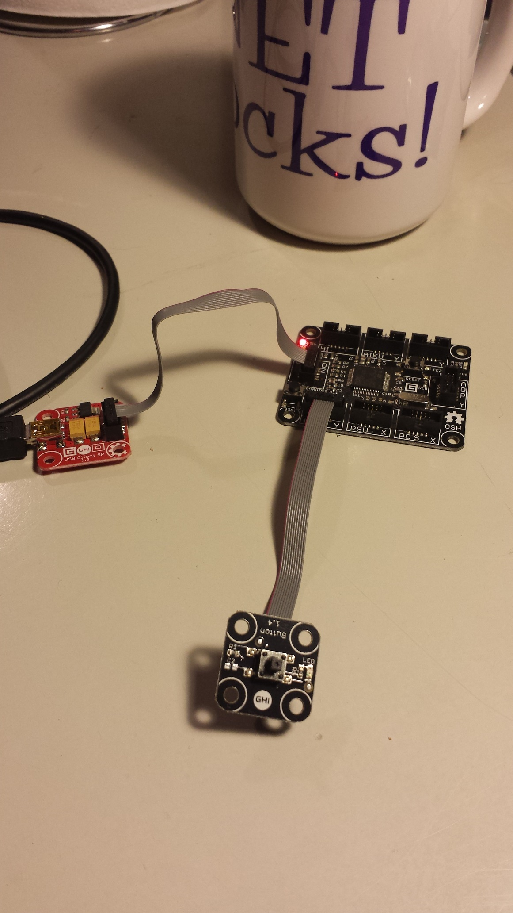

HelloButtonModule
=================

A "Hello world" application with the button module and the Fez Cerberus Gadgeteer mainboard.

Requirements
------------

You need to have a [Fez Cerberus Mainboard](https://www.ghielectronics.com/catalog/product/349), a [USB Client SP](https://www.ghielectronics.com/catalog/product/33) and [Button module](https://www.ghielectronics.com/catalog/product/274) in order to run the program. 
You also need to set up your software as described on the [.net gadgeteer get started page](http://www.netmf.com/gadgeteer/get-started.aspx).

Hardware setup
--------------

You have to connect the hardware module with the mainboard as it is shown in the `Program.gadgeteer` diagram (This is part of the code.). 

Here is a picture of the hardware setup. 

The result
----------

The viewable result of running the code is that the green led light on the button module turns on when the button is pressed (and turns of when the button is released).

I have added a [video of the result](http://youtu.be/Zw9b0Mj0qXM) to youtube.

